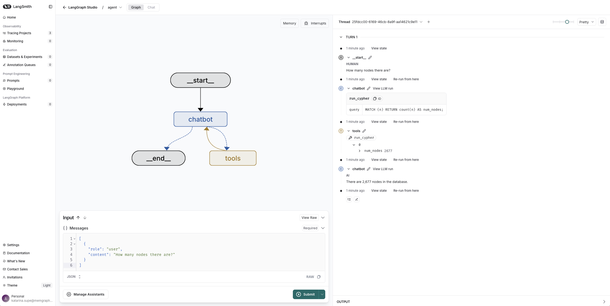
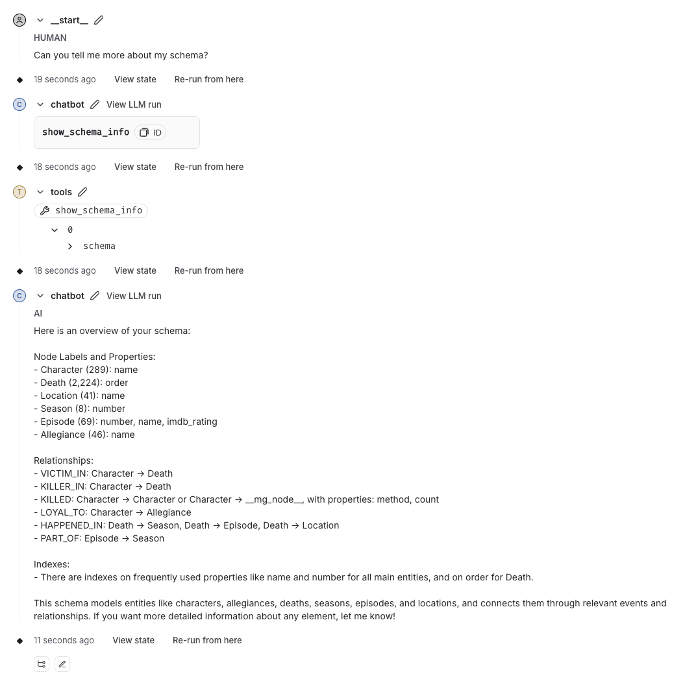

# Graph-Aware Agent with LangGraph and Memgraph AI Toolkit

> [!NOTE]  
> This app was built with the [new LangGraph project template](https://github.com/langchain-ai/new-langgraph-project) and by following the 
> [Quickstart instructions](https://langchain-ai.github.io/langgraph/tutorials/langgraph-platform/local-server/) from the LangGraph documentation to
> create a local LangGraph server.

In this directory, you can find code for a simple agent built using the LangGraph framework and the [Memgraph AI Toolkit](https://github.com/memgraph/ai-toolkit) to demonstrate how to integrate graph-based tooling into your LLM stack. LangGraph helps define structured workflows for language agents, while Memgraph provides powerful graph querying capabilities. Together, they make a compelling combination for building intelligent, context-aware applications.



## Prerequisite

The agent invokes tools that execute queries against Memgraph database, meaning that you need a running Memgraph instance. In the example, Memgraph should be running on `localhost:7687`. To start Memgraph MAGE, run the following command in your terminal:

```
docker run -p 7687:7687 \
  --name memgraph \
  memgraph/memgraph-mage:latest \
  --schema-info-enabled=true
```

Once Memgraph is running, load the data. In this example, Game of Thrones dataset is loaded from [Memgraph Lab](https://memgraph.com/docs/memgraph-lab). 

## Run the app

To run the app, first install the LangGraph CLI:

```
# Python >= 3.11 is required.

pip install --upgrade "langgraph-cli[inmem]"
```

Then, install the dependencies:

```
pip install -e .
```

In the end, create `.env` file. Copy the contents of `.env.example` provided in the directory, and update it with your API keys. Your `.env` might look like this:

```
# To separate your traces from other application
LANGSMITH_PROJECT=new-agent

# Add API keys for connecting to LLM providers, data sources, and other integrations here
OPENAI_API_KEY=""
LANGSMITH_TRACING=""
LANGSMITH_API_KEY=""
```

[LangSmith API](https://docs.smith.langchain.com/administration/how_to_guides/organization_management/create_account_api_key) key can be generated on their site.


To test your agent, launch the LangGraph development server with:

```
langgraph dev
```

This will start a local server and open LangGraph Studio in your browser.
To ask the question, add the following JSON to the input:

```
[
	{
		"role": "user",
		"content": "Can you tell me more about my schema?"
	}
]
```

And click Submit button. You'll see how the agent invokes `show_schema_info()` tool to provide the necessary details. 


